# 설정

## 괄호 색 넣기

- file->preferences->Setting
- bracket pair 검색
- Bracket Pair Colorization: Enabled <- 변경
- Editor>Guides:Bracket Pais -> active 변경
- Editor>Guides:Bracket Pais Horizontal -> active 변경
- Highlight Active Bracket Pair 체크박스 선택

## 저장시 자동 코드 포멧팅

- extention prettier-code formatter 설치
- file->preferences->setting
- Default Fomatter 검색 후 prettier-code formatter 선택
- format on save 검색 후 체크 박스 선택

## 폴더 구조 단계로 본기

- Ctrl + ,로 설정창을 연다
- 검색에 compact folders 검색 후 설정에서 체크를 뺀다.

## 리펙토링 단축키

- Ctrl + Shift + r

## Test파일 만들기 단축키 설정

- Ctrl + k, Ctrl + s를 연속으로 누른다.
- 검색창에 SourceAction를 입력한다.
- 검색된 항목을 선택하여 키를 지정 한다.
- 파일에서 위에서 지정한 키를 입력한다.
- 팝업에서 GenerateTest를 선택한다.

## git hub 저장소 가져오기

- Ctrl + Shift + p
- git clone 입력
- 저장소 선택
- 저장할 곳 선택

## 포터블 버전 만들기

- vscode zip 버전을 다운받는다.
- 압축을 풀고 vscode 폴더에 data 폴더를 만든다.
- data 하위에 tmp폴더를 만든다.
- 업데이트는 신규 vscode를 받아 압축을 풀고 덮어 쓴다.

## Chat with GitHub Copilot

| Action                 | Description                                                                                                                                                                                                                                                            |
| ---------------------- | ---------------------------------------------------------------------------------------------------------------------------------------------------------------------------------------------------------------------------------------------------------------------- |
| `Ctrl+Alt+I`           | **채팅 보기**를 열고 자연어를 사용하여 Copilot과 채팅 대화를 시작합니다.                                                                                                                                                                                               |
| `Ctrl+Shift+I`         | **Copilot 편집 보기**를 열고 여러 파일에 걸쳐 코드 편집 세션을 시작합니다.                                                                                                                                                                                             |
| `Ctrl+Shift+Alt+L`     | **빠른 채팅**을 열고 Copilot에 빠른 질문을 합니다.                                                                                                                                                                                                                     |
| `Ctrl+I`               | **인라인 채팅**을 시작하여 편집기에서 직접 Copilot에 채팅 요청을 보냅니다. 자연어를 사용하거나 `/` 명령어를 사용하여 지시를 내릴 수 있습니다.                                                                                                                          |
| `@`                    | 채팅에서 `@`를 입력하거나 <i class="codicon codicon-mention"></i>을 선택하여 _채팅 참가자_ 목록을 봅니다. 이는 특정 영역에서 도움을 줄 수 있는 도메인 전문가입니다. 확장 프로그램도 추가 참가자를 제공할 수 있습니다.<br/>예: `@workspace 인증은 어떻게 구현되었나요?` |
| 참가자 감지 _(실험적)_ | Copilot Chat은 질문을 적절한 참가자에게 자동으로 라우팅할 수도 있습니다. [자세히 알아보기](https://code.visualstudio.com/updates/v1_93#_automatic-chat-participant-detection-in-chat-view-experimental).                                                               |
| `/`                    | 코드 블록 설명, 테스트 생성 또는 문서화와 같은 일반적으로 사용되는 작업을 요청하는 *슬래시 명령*을 호출합니다.                                                                                                                                                         |
| `/explain`             | 코드 블록이나 프로그래밍 개념을 Copilot에게 설명하도록 요청합니다.                                                                                                                                                                                                     |
| 시계아이콘             | 채팅 보기에서 이 아이콘을 선택하여 채팅 세션 기록에 액세스합니다.                                                                                                                                                                                                      |
| 마이크아이콘           | 음성을 사용하여 채팅 프롬프트를 입력합니다(음성 채팅). 채팅 응답은 소리 내어 읽어줍니다.                                                                                                                                                                               |

## 코드 편집 세션

| Action          | Description                                                                                                                |
| --------------- | -------------------------------------------------------------------------------------------------------------------------- |
| `Ctrl+Shift+I`  | **Copilot 편집 보기**를 열고 여러 파일에 걸쳐 코드 편집 세션을 시작합니다.                                                 |
| +               | 새 편집 세션을 시작합니다.                                                                                                 |
| Edit/Agent mode | Copilot Edits의 편집 모드와 [에이전트 모드(미리보기)](/docs/copilot/copilot-edits.md#use-agent-mode-preview)를 전환합니다. |
| `Add Files...`  | 편집 컨텍스트로 파일을 첨부합니다.                                                                                         |
| `Accept`        | 현재 편집 내용을 모두 수락합니다.                                                                                          |
| `Discard`       | 현재 편집 내용을 모두 취소합니다.                                                                                          |

### Chat variables

채팅 프롬프트에서 채팅 변수를 사용하여 질문과 관련된 컨텍스트를 참조하세요.

| Chat variable          | Description                                                                                                                                                             |
| ---------------------- | ----------------------------------------------------------------------------------------------------------------------------------------------------------------------- |
| `#changes`             | 소스 제어 변경 목록입니다.                                                                                                                                              |
| `#codebase`            | 워크스페이스의 관련 콘텐츠를 프롬프트의 컨텍스트로 추가합니다.                                                                                                          |
| `#editor`              | 활성 편집기의 보이는 내용을 프롬프트의 컨텍스트로 추가합니다.                                                                                                           |
| `#file`                | 워크스페이스에서 파일을 선택하여 프롬프트의 컨텍스트로 추가할 수 있는 빠른 선택 창을 엽니다.                                                                            |
| `#<filename>`          | `#` 뒤에 파일 이름을 입력하여 워크스페이스 파일에 대한 파일 이름 제안을 받고 컨텍스트로 첨부합니다.                                                                     |
| `#folder`              | `#folder:` 뒤에 폴더 이름을 입력하여 워크스페이스에서 폴더를 선택하고 프롬프트의 컨텍스트로 추가합니다. 폴더를 추가하면 해당 폴더 내 모든 파일이 컨텍스트로 추가됩니다. |
| `#problems`            | **문제** 패널에서 워크스페이스 문제와 오류를 컨텍스트로 추가합니다. 코드 수정이나 디버깅 시 유용합니다.                                                                 |
| `#selection`           | 현재 편집기 선택 내용을 프롬프트의 컨텍스트로 추가합니다.                                                                                                               |
| `#sym`                 | 워크스페이스에서 심볼을 선택하여 프롬프트의 컨텍스트로 추가할 수 있는 빠른 선택 창을 엽니다.                                                                            |
| `#<symbol>`            | `#` 뒤에 심볼 이름을 입력하여 워크스페이스 파일에 대한 심볼 제안을 받고 컨텍스트로 첨부합니다.                                                                          |
| `#terminalSelection`   | 현재 터미널 선택 내용을 채팅 프롬프트의 컨텍스트로 추가합니다.                                                                                                          |
| `#terminalLastCommand` | 마지막으로 실행된 터미널 명령을 채팅 프롬프트의 컨텍스트로 추가합니다.                                                                                                  |
| `#testFailure`         | 테스트 실패 정보를 컨텍스트로 추가합니다. [테스트 실행 및 진단](/docs/debugtest/testing.md) 시 유용합니다.                                                              |
| `#VSCodeAPI`           | VS Code 확장 개발과 관련된 질문을 하기 위해 VS Code API를 프롬프트의 컨텍스트로 추가합니다.                                                                             |

## WSL 연결

- 확장프로그램 설치
  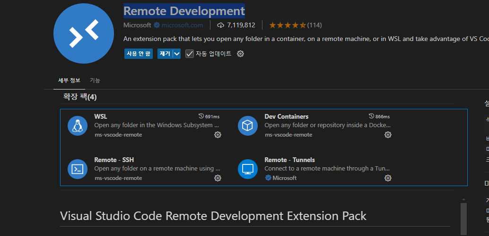
- 연결
  - 왼쪽 하단 초록색 클릭
    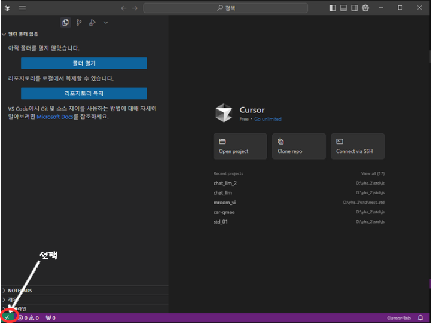
  - WSL연결 선택
    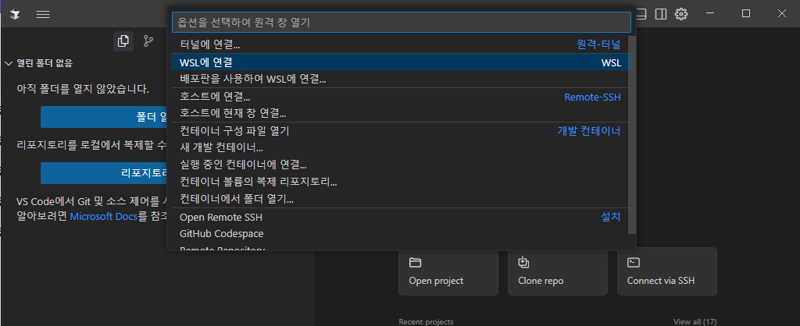

## SSH 연결

- 확장프로그램 설치
  
- HOST 추가
  - shift + p 후 ssh 입력 - 새 ssh 호스트 추가 선택
    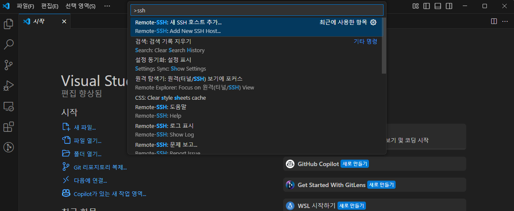
  - host정보 입력
    - 계정@host:port(ex:sshId@host.iptime.org:4444)
      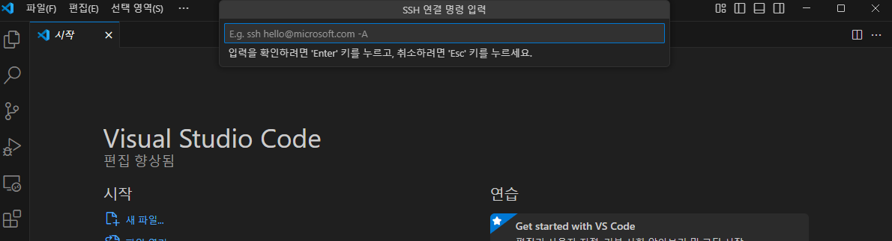
  - 설정파일 선택
    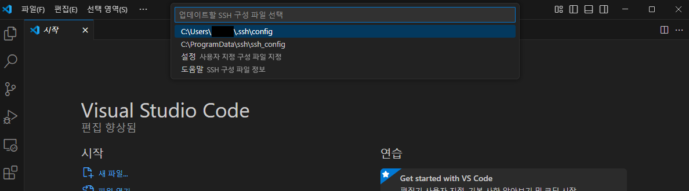
- 연결
  - shift + p 후 ssh 입력 - 호스트 연결 선택
    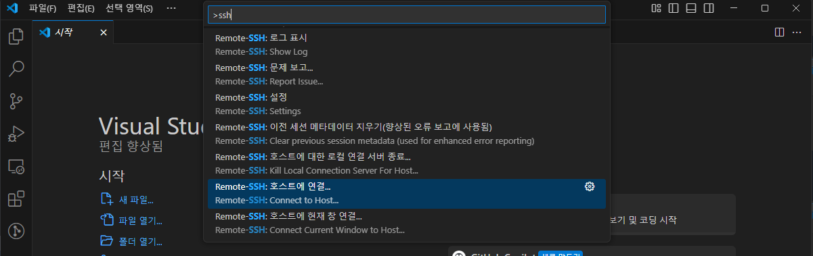
  - 등록한 host 선택
    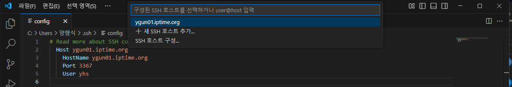
  - 패스워드 입력
    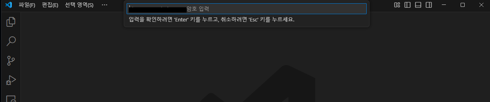
  - 프로젝트 디렉토리 선택
    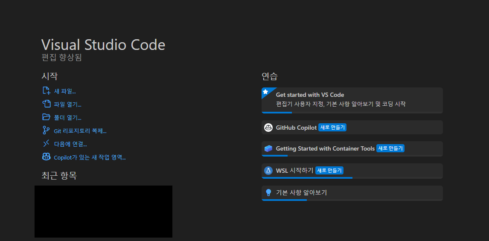
- 패스워드 없이 연결
  - 클라이언트 키 생성(windows powershell)
    > ssh-keygen -t rsa -b 4096
    ```
    Generating public/private rsa key pair.
    Enter file in which to save the key (C:\Users\계정명/.ssh/id_rsa):
    C:\Users\계정명/.ssh/id_rsa already exists.
    Overwrite (y/n)?
    ```
  - 키 확인
    > cd C:\\Users\\계정명\\.ssh  
    > id_rsa, id_rsa.pub 확인
  - 서버에 키 복사
    - 클라이언트에서 생성한 id_rsa.pub 파일 내용을 복사하여 서버의 .ssh 하위 authorized_keys파일에 내용을 붙여 넣기
  - 접속
    - shift + p 후 ssh 입력 - 구성파일 열기
      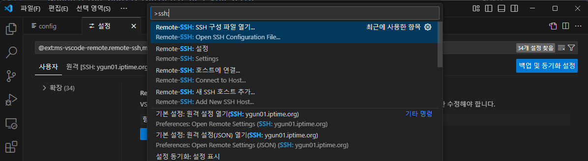
    - 설정파일 선택
      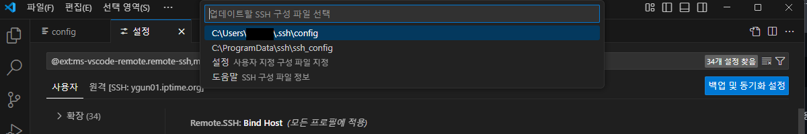
    - 파일 수정
      ```
        Host host.iptime.org
          HostName host.iptime.org
          Port 4444
          User sshId
          IdentityFile C:\Users\계정명\.ssh\id_rsa <-- cnrk
      ```
