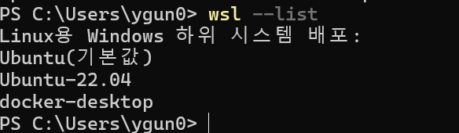

# WSL 설치

## 수동설치 1

- Windows PowerShell 관리자 권한으로 실행

  - 입력

    > dism.exe /online /enable-feature /featurename:Microsoft-Windows-Subsystem-Linux /all /norestart

    > dism.exe /online /enable-feature /featurename:VirtualMachinePlatform /all /norestart

  - 필요시 재부팅
    > wsl --set-default-version 2 <-- 입력

- [마이크로소프트 공식 설치법](https://learn.microsoft.com/ko-kr/windows/wsl/install-manual#downloading-distributions) 링크에서 설치 하고자 하는 OS 다운
  
- 다운 받은 파일 설치

## 수동 설치 2
- 온라인 설치 가능 리스트 확인
  > wsl --list --online 

  
- 설치
  > wsl --install -d Ubuntu-22.0.4
  - 만약 다운로드가 안될시 wsl --install -d Ubuntu-22.0.4 --web-download

- 설치 확인
  > wsl --list

  

## 팁
- 기본 wsl 변경
  > wsl -s Ubuntu-22.0.4